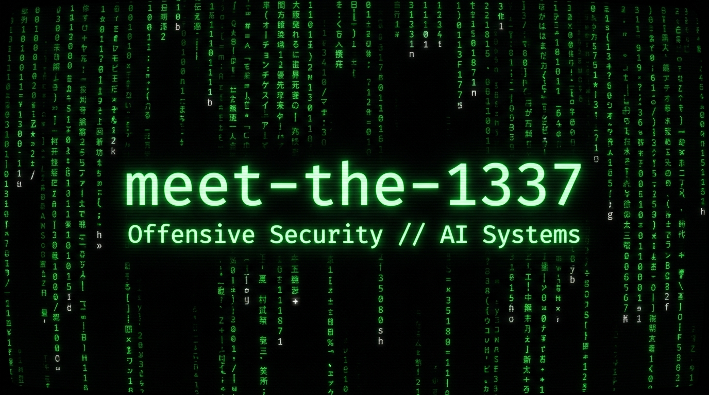

<p align="center">
  
</p>

<p align="center">
  <a href="https://github.com/meet-the-1337">
    
  </a>
</p>

<p align="center">
  <a href="https://www.linkedin.com/in/manan-singhal-a566aa321/"></a>
  <a href="https://tryhackme.com/p/MeetThe1337"></a>
  <a href="https://instagram.com/man.an_17"></a>
  <a href="https://medium.com/@msinghal1_be24"></a>
  <a href="https://reddit.com/user/loyaldog1337"></a>
  <a href="https://stackoverflow.com/users/32120388/manan-singhal"></a>
  <a href="https://twitch.tv/hitntrial"></a>
</p>

---

```python
class MeetThe1337:
    role      = "Offensive Security Researcher & AI Systems Builder"
    education = "B.Tech CSE @ Thapar Institute | CGPA: 8.11"
    ctf       = ["picoCTF (120+)", "TryHackMe (Daily Streak)", "PortSwigger"]
    weapons   = ["Burp Suite", "Wireshark", "Nmap", "Kali Linux", "ESP32"]
    languages = ["Python", "C", "C++", "Bash", "TypeScript"]
    research  = ["Temporal GNNs", "Agentic AI (LangGraph)", "OSINT Intel"]
```

---

### 🔴 What I'm Building

<table>
<tr><td width="50%">

**ReconMind** — Agentic AI security platform. Automated attack framework + BiLSTM classifier. Local Qwen inference (RTX 4060). Six-page FastAPI + React dashboard.

`Python` `LangGraph` `FastAPI` `React` `SQLite`

</td><td width="50%">

**Atlas Watchtower** — OSINT dashboard, 30+ live sources on 3D WebGL map. Client-side ML threat classification (ONNX). Web + PWA + desktop (Tauri/Rust).

`TypeScript` `deck.gl` `MapLibre` `Tauri` `ONNX`

</td></tr>
<tr><td width="50%">

**TGNN Fraud Detection** — Blockchain as temporal graph. Time-aware fraud classification with graph reasoning and anomaly detection.

`Python` `PyTorch` `Graph ML` `Blockchain`

</td><td width="50%">

**ESP32 WiFi & BT Jammer** — 802.11 deauth + BLE channel interference. Built from scratch on ESP32 SDK, no frameworks.

`C` `ESP32` `802.11` `BLE` `Embedded`

</td></tr>
</table>

---

### 🛡️ CTF & Security Practice

```
┌────────────┬───────────────────────────────┬──────────────────────────────────────┐
│ Platform   │ Status                        │ Domains                              │
├────────────┼───────────────────────────────┼──────────────────────────────────────┤
│ picoCTF    │ 120+ challenges (60E + 60M)   │ Web, Crypto, RE, Forensics, Binary   │
│ TryHackMe  │ Daily streak · AoC '25 ✅      │ Web attacks, network, forensics      │
│ PortSwigger│ In progress                   │ SQLi, XSS, CSRF, auth bypasses       │
└────────────┴───────────────────────────────┴──────────────────────────────────────┘
```

> *"I don't rush labs for flags — I redo them until I can explain every step without notes."*

---

### 📊 GitHub Stats

<p align="center">
  
  
</p>

<p align="center">
  
</p>

---

### 🏆 Trophies

<p align="center">
  
</p>

---

### 📈 Activity Graph

<p align="center">
  
</p>

---

### 🐍 Contribution Snake

<picture>
  <source media="(prefers-color-scheme: dark)" srcset="https://raw.githubusercontent.com/meet-the-1337/meet-the-1337/output/github-snake-dark.svg" />
  <source media="(prefers-color-scheme: light)" srcset="https://raw.githubusercontent.com/meet-the-1337/meet-the-1337/output/github-snake.svg" />
  
</picture>

---

### 🔝 Top Contributed Repos

<p align="center">
  
</p>

---

<p align="center">
  
</p>
